# ML for DevOps 🚀

A curated learning and project repository documenting my journey into **Machine Learning (ML)** with a focus on **DevOps and MLOps applications**.  
This repo combines theory, hands-on experiments, and real-world use cases like anomaly detection, predictive scaling, and CI/CD optimization.

---

## 📌 Objectives
- Build a strong foundation in ML concepts.
- Apply ML algorithms to **DevOps problems** (logs, metrics, scaling).
- Showcase hands-on projects for recruiters and peers.
- Document continuous learning and experiments.

---

## 🧠 Roadmap

### 1. Fundamentals
- Data preprocessing & cleaning
- Feature engineering
- Model training & evaluation
- Deployment basics

### 2. Algorithms
- **Supervised Learning**: Linear Regression, Logistic Regression, Random Forest, XGBoost  
- **Unsupervised Learning**: K-Means, PCA, DBSCAN  
- **Anomaly Detection**: Isolation Forest, One-Class SVM, Autoencoders  
- **Deep Learning**: CNNs, LSTMs, Transformers  
- **Reinforcement Learning**: Q-Learning, PPO  

### 3. DevOps Use Cases
- Log anomaly detection (Isolation Forest, Autoencoders)  
- Predictive resource scaling (LSTMs, GRUs)  
- Intelligent alerting & noise reduction (Random Forest, XGBoost)  
- Automated remediation/self-healing (Reinforcement Learning)  

---
```
ml-for-devops/
│
├── data/                # Sample datasets (logs, metrics, synthetic data)
├── notebooks/           # Jupyter notebooks for experiments
├── models/              # Saved ML models
├── scripts/             # Python scripts for pipelines
├── projects/            # End-to-end DevOps ML mini-projects
│   ├── anomaly-detection/
│   ├── predictive-scaling/
│   └── ci-cd-optimization/
└── README.md            # Documentation
```


---

## 🚀 Projects

### 1. **Anomaly Detection in Kubernetes Logs**
- Algorithm: Isolation Forest  
- Goal: Detect unusual log patterns in pods.  

### 2. **Predictive Scaling**
- Algorithm: LSTM  
- Goal: Forecast CPU/memory usage and auto-scale clusters.  

### 3. **CI/CD Optimization**
- Algorithm: XGBoost  
- Goal: Predict pipeline failures and optimize build times.  

---

## 📚 Learning Logs
- Day 1 → Basics of ML workflow  
- Day 2 → Supervised vs Unsupervised learning  
- Day 3 → Anomaly detection applied to logs  
- Day 4 → Time-series forecasting for scaling  
- Day 5 → Reinforcement learning for auto-scaling  

---

## 🛠️ Tech Stack
- Python (NumPy, Pandas, Scikit-learn, TensorFlow, PyTorch)  
- Jupyter Notebooks  
- Docker + Kubernetes  
- MLflow / Kubeflow for MLOps  
- GitHub Actions for CI/CD  

---

## 🤝 Contributions
This repo is part of my **DevOps + ML learning journey**.  
Suggestions, feedback, and collaboration ideas are welcome!

---

## 📧 Contact
- **Author:** Raghvendra  
- **LinkedIn:** [Your LinkedIn Profile]  
- **Blog:** [Hashnode/Medium/WordPress link]  


## 📊 Repository Structure

## 🗺️ ML Roadmap for DevOps

```mermaid
flowchart TD
    A[Machine Learning] --> B[Supervised Learning]
    A --> C[Unsupervised Learning]
    A --> D[Reinforcement Learning]
    A --> E[Extensions]

    %% Supervised
    B --> B1[Regression]
    B --> B2[Classification]
    B1 --> B1a[Linear Regression --> Predict resource usage]
    B1 --> B1b[Ridge/Lasso --> Forecast SLA breaches]
    B2 --> B2a[Logistic Regression --> Alert classification]
    B2 --> B2b[Decision Trees --> Failure prediction]
    B2 --> B2c[Random Forest --> Incident severity prediction]
    B2 --> B2d[XGBoost/LightGBM --> CI/CD pipeline optimization]

    %% Unsupervised
    C --> C1[Clustering]
    C --> C2[Dimensionality Reduction]
    C1 --> C1a[K-Means --> Group similar logs]
    C1 --> C1b[DBSCAN --> Detect anomalies in metrics]
    C2 --> C2a[PCA --> Reduce log features]
    C2 --> C2b[Autoencoders --> Noise reduction in monitoring]

    %% Reinforcement
    D --> D1[Q-Learning --> Auto-scaling policies]
    D --> D2[Deep Q-Networks --> Self-healing clusters]
    D --> D3[PPO/Actor-Critic --> Dynamic resource allocation]

    %% Extensions
    E --> E1[Semi-Supervised Learning]
    E --> E2[Self-Supervised Learning]
    E --> E3[Anomaly Detection]

    E1 --> E1a[Semi-Supervised SVM --> Limited labeled logs]
    E2 --> E2a[Transformers --> Log/NLP analysis]
    E2 --> E2b[Contrastive Learning --> Metric embeddings]
    E3 --> E3a[Isolation Forest --> Log anomaly detection]
    E3 --> E3b[One-Class SVM --> Intrusion detection]
    E3 --> E3c[Local Outlier Factor --> Sensor fault detection]
    E3 --> E3d[Autoencoders --> Anomaly detection in metrics]
```


