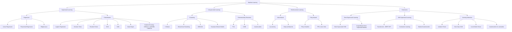

```mermaid
flowchart TD
    A[Machine Learning] --> B[Supervised Learning]
    A --> C[Unsupervised Learning]
    A --> D[Reinforcement Learning]
    A --> E[Extensions]

    %% Supervised Layer
    B --> B1[Regression]
    B --> B2[Classification]
    B1 --> B1a[Linear Regression]
    B1 --> B1b[Polynomial Regression]
    B1 --> B1c[Ridge/Lasso]
    B2 --> B2a[Logistic Regression]
    B2 --> B2b[Decision Trees]
    B2 --> B2c[Random Forest]
    B2 --> B2d[SVM]
    B2 --> B2e[KNN]
    B2 --> B2f[Naive Bayes]
    B2 --> B2g[Gradient Boosting: XGBoost, LightGBM, CatBoost]

    %% Unsupervised Layer
    C --> C1[Clustering]
    C --> C2[Dimensionality Reduction]
    C1 --> C1a[K-Means]
    C1 --> C1b[Hierarchical Clustering]
    C1 --> C1c[DBSCAN]
    C1 --> C1d[Gaussian Mixture Models]
    C2 --> C2a[PCA]
    C2 --> C2b[t-SNE]
    C2 --> C2c[Autoencoders]

    %% Reinforcement Layer
    D --> D1[Value-Based]
    D --> D2[Policy-Based]
    D1 --> D1a[Q-Learning]
    D1 --> D1b[Deep Q-Networks]
    D2 --> D2a[Policy Gradient]
    D2 --> D2b[PPO, Actor-Critic]

    %% Extensions Layer
    E --> E1[Semi-Supervised Learning]
    E --> E2[Self-Supervised Learning]
    E --> E3[Anomaly Detection]

    E1 --> E1a[Semi-Supervised SVM]
    E1 --> E1b[Graph-Based Semi-Supervised Models]

    E2 --> E2a[Transformers - BERT GPT]
    E2 --> E2b[Contrastive Learning]
    E2 --> E2c[Masked Autoencoders]

    E3 --> E3a[Isolation Forest]
    E3 --> E3b[One-Class SVM]
    E3 --> E3c[Local Outlier Factor]
    E3 --> E3d[Autoencoders for anomalies]
```
